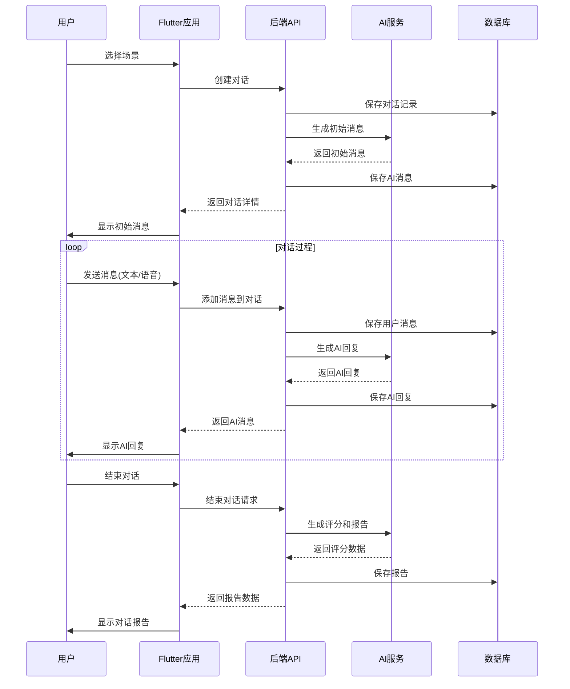

# Talk to AI 系统架构文档

## 概述

Talk to AI 是一个基于AI的俄语学习对话系统，旨在通过真实场景对话帮助用户练习俄语口语能力。系统采用前后端分离架构，后端使用Python/FastAPI构建，前端使用Flutter构建。

## 系统架构图

```
┌─────────────────────────────────────────────────────────────────────┐
│                          客户端层                                   │
├─────────────────────────────────────────────────────────────────────┤
│                    Flutter 移动应用 (Dart)                          │
├─────────────────────────────────────────────────────────────────────┤
│                          API层                                      │
├─────────────────────────────────────────────────────────────────────┤
│                    FastAPI 后端服务 (Python)                       │
├─────────────────────────────────────────────────────────────────────┤
│                    业务逻辑层 & AI服务层                            │
├─────────────────────────────────────────────────────────────────────┤
│  对话服务  │  场景服务  │  报告服务  │  语音服务  │  认证服务  │ AI服务 │
├─────────────────────────────────────────────────────────────────────┤
│                          数据访问层                                 │
├─────────────────────────────────────────────────────────────────────┤
│                   SQLite 数据库 (SQLAlchemy)                        │
├─────────────────────────────────────────────────────────────────────┤
│                          第三方服务                                 │
├─────────────────────────────────────────────────────────────────────┤
│  DashScope/Qwen AI  │  语音识别API  │  文本转语音API  │  翻译API   │
└─────────────────────────────────────────────────────────────────────┘
```

## 技术架构

### 后端架构

后端采用分层架构设计，包含以下层次：

1. **API层**: 提供RESTful API接口，使用FastAPI框架实现
2. **业务逻辑层**: 实现核心业务逻辑，包括对话、场景、报告等服务
3. **数据访问层**: 使用SQLAlchemy ORM访问SQLite数据库
4. **第三方服务层**: 集成阿里云DashScope、语音识别等第三方服务

#### 目录结构

```
backend/
├── app/
│   ├── api/              # API路由
│   │   └── v1/
│   │       ├── api.py    # 路由聚合
│   │       └── endpoints/ # API端点实现
│   ├── core/             # 核心配置
│   ├── models/           # 数据库模型
│   ├── schemas/          # 数据验证模型
│   ├── services/         # 业务逻辑实现
│   └── utils/            # 工具函数
├── storage/              # 音频文件存储
├── cache/                # 离线缓存
├── main.py              # 应用入口
└── requirements.txt     # 依赖列表
```

#### 核心服务

1. **认证服务** (`auth_service.py`)
   - 提供匿名用户创建功能
   - JWT Token生成和验证

2. **对话服务** (`conversation_service.py`)
   - 对话创建和管理
   - 消息处理和AI回复生成
   - 对话报告数据生成

3. **场景服务** (`scenario_service.py`)
   - 场景模板管理
   - 自定义场景创建

4. **报告服务** (`report_service.py`)
   - 对话报告生成和管理
   - 报告导出功能

5. **语音服务** (`voice_service.py`)
   - 语音识别
   - 文本翻译
   - 文本转语音

6. **AI服务** (`ai_service.py`)
   - AI对话回复生成
   - 用户表达评分和评价

7. **离线服务** (`offline_service.py`)
   - 离线对话数据保存
   - 离线数据同步

### 前端架构

前端采用组件化架构设计，基于Flutter框架实现：

#### 目录结构

```
frontend/
├── lib/
│   ├── models/           # 数据模型
│   ├── screens/          # 页面组件
│   ├── services/         # 服务层
│   ├── widgets/          # 自定义组件
│   └── utils/            # 工具函数
├── assets/               # 静态资源
└── pubspec.yaml         # 依赖配置
```

#### 核心模块

1. **模型层** (`models/`)
   - Conversation: 对话模型
   - Message: 消息模型
   - Scenario: 场景模型
   - Report: 报告模型

2. **服务层** (`services/`)
   - ApiService: API调用封装

3. **页面层** (`screens/`)
   - ScenarioScreen: 场景选择页面
   - CustomScenarioScreen: 自定义场景页面
   - ChatScreen: 对话页面

4. **组件层** (`widgets/`)
   - MessageBubble: 消息气泡组件
   - AudioPlayer: 音频播放组件
   - ScenarioCard: 场景卡片组件

## 数据流设计

### 对话流程



## 数据库设计

### 核心表结构

1. **users** - 用户表
   - id: 主键
   - username: 用户名
   - created_at: 创建时间

2. **scenarios** - 场景表
   - id: 主键
   - title: 标题
   - description: 描述
   - location: 地点
   - time_of_day: 时间
   - characters: 角色列表(JSON)
   - created_at: 创建时间
   - updated_at: 更新时间

3. **conversations** - 对话表
   - id: 主键
   - scenario_id: 场景ID(外键)
   - user_id: 用户ID(外键)
   - status: 状态
   - started_at: 开始时间
   - ended_at: 结束时间

4. **messages** - 消息表
   - id: 主键
   - conversation_id: 对话ID(外键)
   - sender: 发送者
   - content: 内容
   - audio_url: 音频URL
   - audio_duration: 音频时长
   - is_thinking: 是否正在思考
   - timestamp: 时间戳

5. **reports** - 报告表
   - id: 主键
   - conversation_id: 对话ID(外键)
   - highlights: 高亮金句(JSON)
   - sentiment_analysis: 情感分析(JSON)
   - suggestions: 改进建议(JSON)
   - pronunciation_score: 发音评分
   - grammar_score: 语法评分
   - fluency_score: 流利度评分
   - vocabulary_score: 词汇评分
   - overall_score: 综合评分
   - generated_at: 生成时间

## API设计

### 核心API端点

1. **认证API**
   - POST `/auth/anonymous` - 创建匿名用户

2. **场景API**
   - GET `/scenarios/` - 获取场景列表
   - POST `/scenarios/` - 创建新场景
   - GET `/scenarios/{id}` - 获取场景详情
   - PUT `/scenarios/{id}` - 更新场景
   - DELETE `/scenarios/{id}` - 删除场景

3. **对话API**
   - POST `/conversations/` - 创建新对话
   - GET `/conversations/{id}` - 获取对话详情
   - PUT `/conversations/{id}` - 更新对话状态
   - POST `/conversations/{id}/messages/text` - 添加文本消息
   - POST `/conversations/{id}/messages/voice` - 添加语音消息
   - GET `/conversations/{id}/messages/` - 获取对话消息列表
   - PUT `/conversations/messages/{id}` - 更新消息状态
   - POST `/conversations/{id}/end/` - 结束对话并生成报告

4. **报告API**
   - GET `/reports/{id}` - 根据报告ID获取报告
   - GET `/reports/conversation/{id}` - 根据对话ID获取报告
   - POST `/reports/export/` - 导出报告

5. **离线API**
   - POST `/offline/save/` - 保存离线对话
   - GET `/offline/list/` - 获取离线对话列表

详细API文档请参考 [backend/API_DOCUMENTATION.md](../backend/API_DOCUMENTATION.md)

## 部署架构

### 开发环境

- 后端: FastAPI + Uvicorn 开发服务器
- 前端: Flutter开发环境
- 数据库: SQLite

### 生产环境

- 后端: FastAPI + Gunicorn/Uvicorn Worker
- 前端: 编译为原生应用(Android APK/iOS IPA)或Web应用
- 数据库: SQLite(单机)或PostgreSQL(集群)
- 反向代理: Nginx

### 部署拓扑

```
                    ┌────────────────────┐
                    │   用户设备         │
                    │  (移动/Web)        │
                    └─────────┬──────────┘
                              │
                    ┌─────────▼──────────┐
                    │     CDN/反向代理    │
                    │      (Nginx)       │
                    └─────────┬──────────┘
                              │
         ┌────────────────────┼────────────────────┐
         │                    │                    │
┌────────▼────────┐  ┌────────▼────────┐  ┌────────▼────────┐
│   Flutter Web   │  │  Android App    │  │   iOS App       │
└─────────────────┘  └─────────────────┘  └─────────────────┘
         │                    │                    │
         └────────────────────┼────────────────────┘
                              │
                    ┌─────────▼──────────┐
                    │   API网关/负载均衡   │
                    └─────────┬──────────┘
                              │
                    ┌─────────▼──────────┐
                    │   FastAPI服务集群   │
                    │  (Gunicorn + 多Worker)│
                    └─────────┬──────────┘
                              │
                    ┌─────────▼──────────┐
                    │     数据库集群      │
                    │  (PostgreSQL/MySQL) │
                    └────────────────────┘
```

## 安全设计

### 认证与授权

- 使用JWT Token进行用户认证
- 匿名用户支持，无需注册即可使用
- API访问权限控制

### 数据安全

- 敏感数据加密存储
- HTTPS通信加密
- 音频文件访问控制

### 应用安全

- 输入数据验证和过滤
- 防止SQL注入
- 防止跨站脚本攻击(XSS)

## 性能优化

### 后端优化

- 数据库连接池
- API响应缓存
- 异步处理任务
- 数据库索引优化

### 前端优化

- 图片和音频资源压缩
- 组件懒加载
- 离线缓存机制
- 响应式UI设计

## 扩展性设计

### 水平扩展

- 微服务架构支持
- 数据库读写分离
- 缓存层引入
- 消息队列解耦

### 功能扩展

- 多语言支持
- 更多场景模板
- 个性化学习路径
- 社交功能集成

## 监控与运维

### 日志系统

- 结构化日志记录
- 错误追踪和报警
- 性能指标监控

### 健康检查

- API可用性监控
- 数据库连接状态
- 第三方服务状态

### 备份与恢复

- 数据库定期备份
- 音频文件备份策略
- 灾难恢复计划